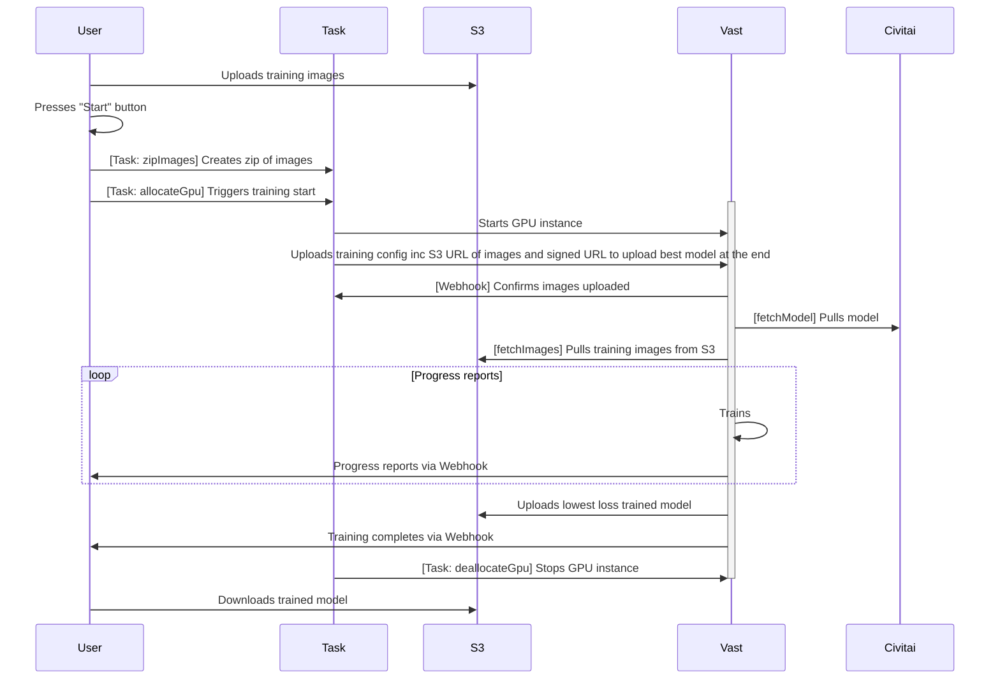
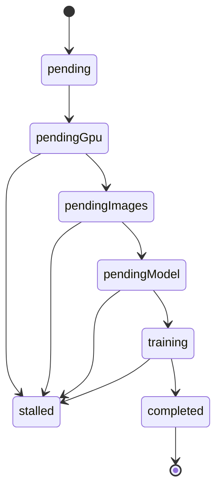

# Overall app flow



# ERD

ERD can be found here: [ERD.md](ERD.md).
Generated with `npm run prisma:generate`

Training statuses:



All the things that must happen before training can begin

-   User must have uploaded all their images
    -   Presses "Start"
-   A zip must have been created of all those images
    -   [Task: zipImages]
-   The GPU must be allocated and active and must have been told
    -   [Task: allocateGpu]
    -   the presignedURL of that zip,
    -   the model to download,
    -   the civitai API key to use,
    -   the model's config, and
    -   the URL & signing secret of the webhook to use
    -   [webhook callback when kohya is ready & installed, or perhaps when API starts]
-   The GPU must have downloaded
    -   the zip [webhook callback after it's been unzipped]
    -   the model, and [webhook callback after it's been downloaded]
    -   must have put the config the zip and the model in the expected places [webhook callback when everything is ready]

As a results we have several indicators of readiness, each a webhook callback:

-   The GPU is ready
-   The GPU has downloaded the zip
-   The GPU has downloaded the model
-   The GPU has positioned everything correctly

As training commences, additional callbacks are made:

-   The GPU is training at X%
-   The GPU has completed training
-   The GPU has uploaded the model to S3

# Installation of sd-scripts

On WSL ubuntu: `sudo apt-get install build-essential lzma tk-dev liblzma-dev libreadline-dev libffi-dev zlib1g zlib1g-dev libssl-dev libbz2-dev libsqlite3-dev`

Then...

```bash
cd sd-scripts

curl -L https://github.com/pyenv/pyenv-installer/raw/master/bin/pyenv-installer | bash

echo 'export PYENV_ROOT="$HOME/.pyenv"' >> ~/.profile
echo 'command -v pyenv >/dev/null || export PATH="$PYENV_ROOT/bin:$PATH"' >> ~/.profile
echo 'eval "$(pyenv init -)"' >> ~/.profile

echo 'export PYENV_ROOT="$HOME/.pyenv"' >> ~/.bashrc
echo 'command -v pyenv >/dev/null || export PATH="$PYENV_ROOT/bin:$PATH"' >> ~/.bashrc
echo 'eval "$(pyenv init -)"' >> ~/.bashrc

pyenv install 3.10.6
pyenv local 3.10.6

python -m venv venv
source venv/bin/activate

pip install torch==2.1.2 torchvision==0.16.2 --index-url https://download.pytorch.org/whl/cu118
pip install --upgrade -r requirements.txt
pip install xformers==0.0.23.post1 --index-url https://download.pytorch.org/whl/cu118
```

# Building Kohya_docker

```
cd kohya_docker/build
docker build . -t xcession2k/kohya_rest:latest --build-arg KOHYA_BUILD_REF=main
docker login
docker push xcession2k/kohya_rest:latest
```

# Webapp build system

We have to build the remix app, and the server separately. The server is built with esbuild, and the remix app is built with vite.

Due to old dependencies without ESM in the server, the server is built with the --format=cjs flag. The remix app is built with the --format=esm flag.

Due to the frustration of esbuild needing scripting for multiple files, the server is built with the --bundle flag as this includes all files imported.

The server is built with a few externals like --external:lightningcss due to errors thrown by esbuild.
