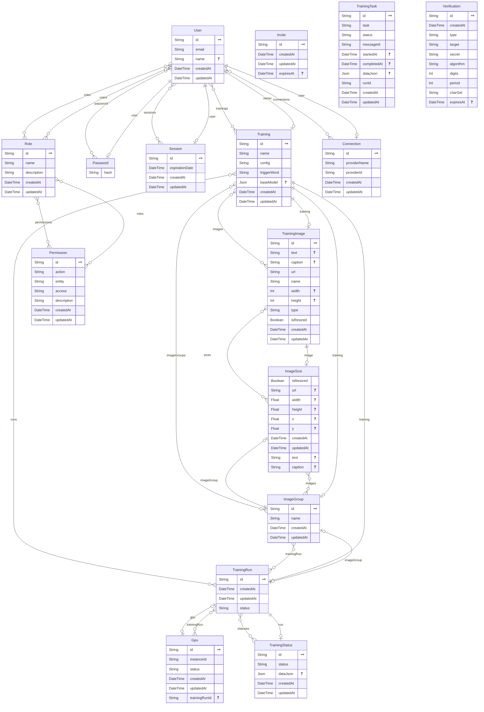

```mermaid
erDiagram

  "User" {
    String id "🗝️"
    String email 
    String name "❓"
    DateTime createdAt 
    DateTime updatedAt 
    }
  

  "Invite" {
    String id "🗝️"
    DateTime createdAt 
    DateTime updatedAt 
    DateTime expiresAt "❓"
    }
  

  "Training" {
    String id "🗝️"
    String name 
    String config 
    String triggerWord 
    Json baseModel "❓"
    DateTime createdAt 
    DateTime updatedAt 
    }
  

  "TrainingRun" {
    String id "🗝️"
    DateTime createdAt 
    DateTime updatedAt 
    String status 
    }
  

  "TrainingTask" {
    String id "🗝️"
    String task 
    String status 
    String messageId 
    DateTime startedAt "❓"
    DateTime completedAt "❓"
    Json dataJson "❓"
    String runId 
    DateTime createdAt 
    DateTime updatedAt 
    }
  

  "TrainingStatus" {
    String id "🗝️"
    String status 
    Json dataJson "❓"
    DateTime createdAt 
    DateTime updatedAt 
    }
  

  "TrainingImage" {
    String id "🗝️"
    String text "❓"
    String caption "❓"
    String url 
    String name 
    Int width "❓"
    Int height "❓"
    String type 
    Boolean isResized 
    DateTime createdAt 
    DateTime updatedAt 
    }
  

  "ImageGroup" {
    String id "🗝️"
    String name 
    DateTime createdAt 
    DateTime updatedAt 
    }
  

  "ImageSize" {
    Boolean isResized 
    String url "❓"
    Float width "❓"
    Float height "❓"
    Float x "❓"
    Float y "❓"
    DateTime createdAt 
    DateTime updatedAt 
    String text "❓"
    String caption "❓"
    }
  

  "Password" {
    String hash 
    }
  

  "Session" {
    String id "🗝️"
    DateTime expirationDate 
    DateTime createdAt 
    DateTime updatedAt 
    }
  

  "Permission" {
    String id "🗝️"
    String action 
    String entity 
    String access 
    String description 
    DateTime createdAt 
    DateTime updatedAt 
    }
  

  "Role" {
    String id "🗝️"
    String name 
    String description 
    DateTime createdAt 
    DateTime updatedAt 
    }
  

  "Verification" {
    String id "🗝️"
    DateTime createdAt 
    String type 
    String target 
    String secret 
    String algorithm 
    Int digits 
    Int period 
    String charSet 
    DateTime expiresAt "❓"
    }
  

  "Connection" {
    String id "🗝️"
    String providerName 
    String providerId 
    DateTime createdAt 
    DateTime updatedAt 
    }
  

  "Gpu" {
    String id "🗝️"
    String instanceId 
    String status 
    DateTime createdAt 
    DateTime updatedAt 
    String trainingRunId "❓"
    }
  
    "User" o{--}o "Password" : "password"
    "User" o{--}o "Training" : "trainings"
    "User" o{--}o "Role" : "roles"
    "User" o{--}o "Session" : "sessions"
    "User" o{--}o "Connection" : "connections"
    "Training" o|--|| "User" : "owner"
    "Training" o{--}o "TrainingImage" : "images"
    "Training" o{--}o "TrainingRun" : "runs"
    "Training" o{--}o "ImageGroup" : "imageGroups"
    "TrainingRun" o|--|o "Gpu" : "gpu"
    "TrainingRun" o|--|| "Training" : "training"
    "TrainingRun" o|--|o "ImageGroup" : "imageGroup"
    "TrainingRun" o{--}o "TrainingStatus" : "statuses"
    "TrainingStatus" o|--|| "TrainingRun" : "run"
    "TrainingImage" o|--|| "Training" : "training"
    "TrainingImage" o{--}o "ImageSize" : "sizes"
    "ImageGroup" o{--}o "ImageSize" : "images"
    "ImageGroup" o{--}o "TrainingRun" : "trainingRun"
    "ImageGroup" o|--|| "Training" : "training"
    "ImageSize" o|--|| "TrainingImage" : "image"
    "ImageSize" o|--|| "ImageGroup" : "imageGroup"
    "Password" o|--|| "User" : "user"
    "Session" o|--|| "User" : "user"
    "Permission" o{--}o "Role" : "roles"
    "Role" o{--}o "User" : "users"
    "Role" o{--}o "Permission" : "permissions"
    "Connection" o|--|| "User" : "user"
    "Gpu" o{--}o "TrainingRun" : "trainingRun"
```
